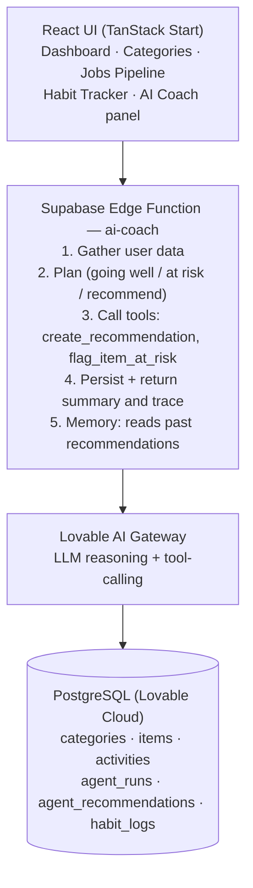

# CtrlTrack AI

**Control Your Goals. Track Your Progress.**

CtrlTrack AI is a personal Life & Career Operating System — not just another to-do app. It tracks job applications, habits, learning, certifications, goals, and daily tasks in one place, and layers a real AI agent on top that reasons across all of it to surface insights a plain task list never could.

Built for the **Kaggle + Google "AI Agents: Intensive Vibe Coding Capstone"** — Concierge Agents track.

🔗 **Live demo:** [ctrltrack.lovable.app](https://ctrltrack.lovable.app)

---

## Why CtrlTrack AI is different

Most productivity apps track categories in isolation. CtrlTrack's AI Coach reasons **across** categories — the way a human mentor would — and can notice things like:

> "You're actively applying to Java roles but haven't touched your Learning category in 9 days — certifications without job applications won't move your career forward on their own."

That kind of cross-domain synthesis is the core differentiator from a generic checklist app.

---

## Features

### Core productivity platform
- Email + Google authentication
- Dashboard with live stats, progress cards, and an activity feed
- Unlimited custom categories, plus starter categories: Jobs Applied, Learning, Certifications, Goals, Habits, Daily Goals, Fitness, General Tasks
- Full activity history (created / updated / completed / deleted)
- Profile with avatar, name, and career goal

### Structured category experiences
Rather than treating every category as a generic list, two categories get purpose-built interfaces:

- **Jobs Applied — pipeline tracker**
  Company, role, application status (Applied → Recruiter Action → Interview → Reviewed → Offer / Rejected), resume-sent tracking, and applied date. A live status-count strip shows your pipeline at a glance, and each application can be moved between stages with one click.

- **Habits — daily tick tracker**
  A 14-day tick grid per habit, live streak counting, and a rolling 30-day consistency percentage — so habits are tracked the way a real habit tracker works, not as a one-off checkbox.

### AI Coach — the agent layer
The Coach is a genuine AI agent, not a templated stats page. On each run it:

1. **Plans** — works through the user's data in explicit steps: what's going well, what's falling behind, what to recommend right now
2. **Uses tools** — calls `create_recommendation` and `flag_item_at_risk` as real function calls against the user's live data, rather than only returning free text
3. **Remembers** — every recommendation is persisted, and the agent reads its own past recommendations before generating new ones, so it can build on prior advice instead of repeating itself

The Coach's reasoning trace (which tools it called, with what arguments) is shown directly in the UI, so its decision-making is transparent rather than a black box.

---

## Tech stack

**Frontend**
- React 19
- TanStack Start / TanStack Router / TanStack Query
- Tailwind CSS + shadcn/ui
- Lucide Icons

**Backend**
- Lovable Cloud (managed Supabase under the hood): PostgreSQL, Authentication, Row-Level Security, Storage
- Supabase Edge Functions (Deno) for the AI agent logic
- Lovable AI Gateway for LLM access — no separate API key or billing required

**Deployment**
- Hosted and built via Lovable
- Two-way GitHub sync (this repo)

---

## Architecture



---

## AI Agent concepts demonstrated

This project explicitly demonstrates three agent concepts from the course:

| Concept | Where it lives |
|---|---|
| **Planning** | The Coach's system prompt requires it to reason in explicit steps (what's going well → what's at risk → what to recommend) before producing output, rather than answering in one shot |
| **Tool use** | The agent calls real, defined functions (`create_recommendation`, `flag_item_at_risk`) via function-calling, executed against the live Supabase database, rather than only generating descriptive text |
| **Memory** | Past recommendations are persisted to `agent_recommendations` and passed back into the next run's context, so the agent avoids repeating advice and can build on what it already told the user |

---

## Database schema (key tables)

- `categories` — user-defined and starter categories
- `items` — tasks/goals/habits, extended with job-pipeline fields (`job_company`, `job_role`, `job_status`, `job_resume_sent`, `job_applied_date`) used only by the Jobs Applied category
- `habit_logs` — one row per habit per day it was completed, powering streaks and the tick grid
- `activities` — full audit trail of user actions
- `agent_recommendations` — the AI Coach's persisted recommendations (memory)
- `agent_runs` — a trace log of each agent run's plan and tool calls (transparency)

All tables use Row-Level Security so users can only ever access their own data.

---

## Setup instructions

CtrlTrack is built and hosted through [Lovable](https://lovable.dev), with two-way GitHub sync.

### To view/run the deployed app
Visit the live demo link above — no setup required.

### To run this repo locally
```bash
git clone https://github.com/Harsha-Battala/ctrltrack.git
cd ctrltrack
bun install
bun run dev
```

### Backend setup
This project uses **Lovable Cloud**, a managed backend built on Supabase. All database tables, Row-Level Security policies, and the `ai-coach` Edge Function are defined in `supabase/migrations/` and `supabase/functions/`. When synced through Lovable:

1. Pending migrations are applied via Lovable's chat: *"Apply the pending database migration"*
2. The Edge Function is deployed via: *"Deploy the ai-coach edge function"*
3. No external API key is required — the AI Coach uses Lovable's built-in AI Gateway (`LOVABLE_API_KEY`, auto-provisioned)

### Environment variables
Frontend Supabase connection values are stored in `.env` (safe to be public, browser-exposed by design). No secrets need to be manually configured for local development against the deployed backend.

---

## Project philosophy

This is explicitly **not** a to-do app with an AI feature bolted on. The starting point was a categorized task manager; the goal was to make it into something a plain to-do list structurally cannot be — a system that notices patterns across a person's whole life (career, learning, habits, fitness) and actively recommends what matters most, right now.

---

## Roadmap

- [ ] Update AI Coach system prompt to explicitly reason over job-pipeline stages and habit streaks by name
- [ ] Visual analytics (charts) for job pipeline funnel and habit consistency trends
- [ ] Reflection loop: agent reviews whether its past recommendations were acted on and adjusts future advice accordingly

---

## Submission

- **Track:** Concierge Agents
- **Author:** Harsha Battala ([@Harsha-Battala](https://github.com/Harsha-Battala))
- **Competition:** Kaggle + Google AI Agents: Intensive Vibe Coding Capstone
